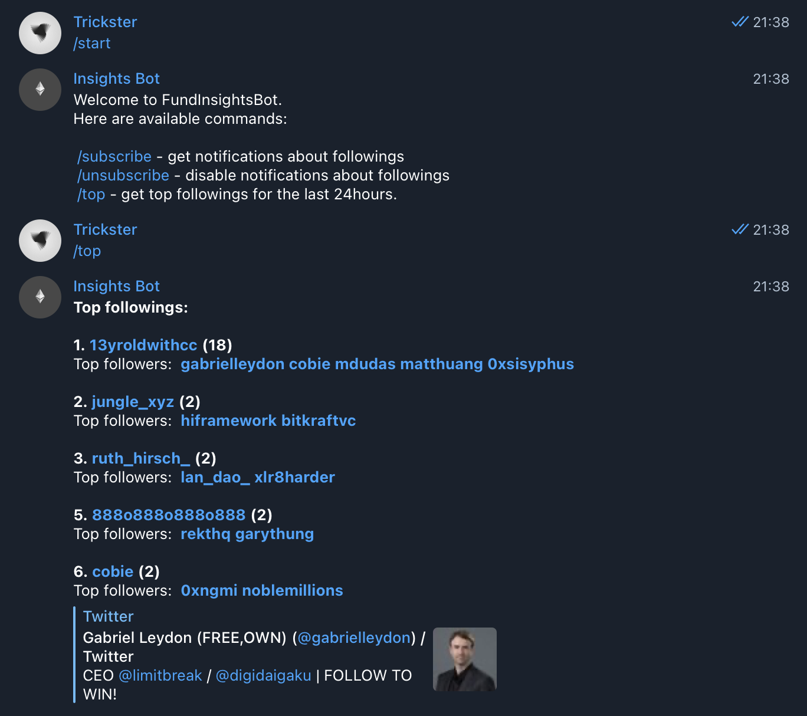
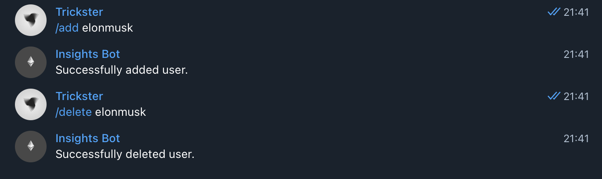

# twitter-tools
Bot for tracking new user followings on Twitter with telegram bot.

### Current features
1. Get top users by followings for the last 24 hours.
   
   It shows users with at least 2 followers from tracked accounts.


2. Subscribe on notifications of new followings
3. Add/Delete users to track

### Screenshots

Get top users by followings.




Subscribe on notifications.


Add, delete user from tracking list.




### Installation

1. Clone the repository.
```
git clone https://github.com/fidesy/twitter-tools.git
```

2. Fill in variables into .env file. [Example](.env).

3. Create the client certificates.
```
mkdir certs
openssl genrsa -out certs/client.key 4096
openssl req -new -x509 -text -key certs/client.key -out certs/client.crt
```

4. Run application with docker compose.
```
docker compose up -d
```